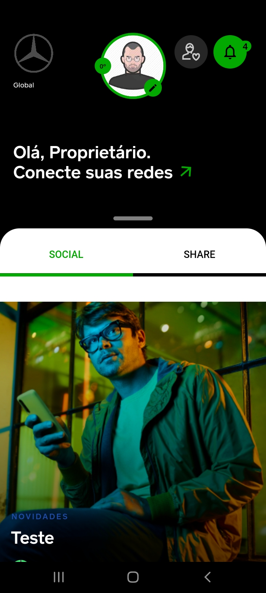
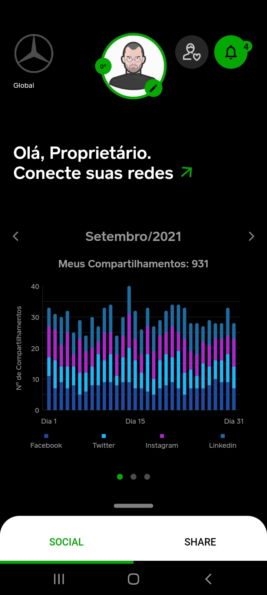
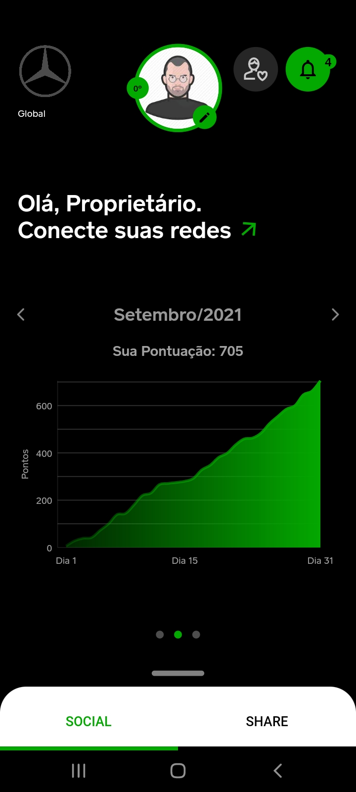
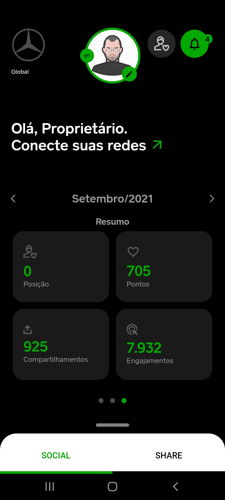
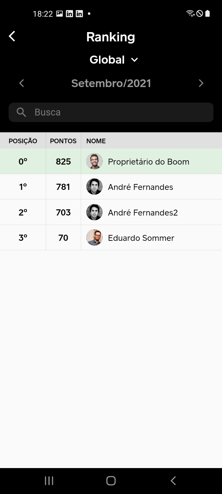
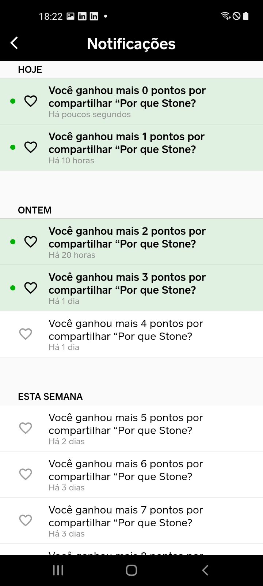
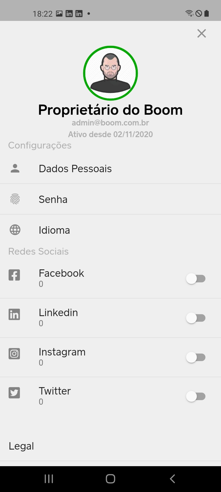

# 👋 Hi, I’m @rafaelqcosta. I'm a Flutter Developer 

The great pleasure introduce my self.

I’m Rafael Costa , Im from Brazil. Since 10 years I’m working as developer. Have developed many Web Systems and Mobile

With over five years of experience in mobile application development. I currently work with Flutter. Four years ago I started studying Flutter and I haven't stopped. It's the best tool I've ever worked with.

## Technical Skills

- **Languages:** Dart, Flutter,  Java, JavaScript, Angular, C#, SQL, NoSQL
- **Cloud Platforms:** Firebase, AWS
- **Methodologies:** Agile, Scrum, Kanban

## Experiences

- **State Management:** Bloc, Mobx,  Getx, Triple
- **Firebase** Storage, Firestore, Analytics, Crashlytics, AppDistribution, Authentication, Push Notification
- **Google Maps API**
- **Tets:** TDD, BDD 
- **Design Thinking**
- **Google Play and Apple Store Consoles** experience in app publishing
- **Achitecture:** Clean Architecture, Modular, DDD, 
- 

## Education & Training

Bachelor's Degree in Systems Analysis and Development, Catholic university of Brasília, BR - 2011 - 2015

Web development with C# and ASP.NET, National Service for Industrial Learning (SENAI) - BR - 2012

## Certificates

- **MTA** - Microsoft Technology Associate (Certification nº: E078-4810)
- **MCP** - Microsoft Certified Profissional (Certification nº: D724-9116)
- **Scrum** Fundamentals Certified Credential (ID nº: 101167)
- Six Sigma **White Belt** - S.S.C. and Aveta Business Institute
- Six Sigma **Yellow Belt** (ID nº 72260) - Six Sigma Study
- CP-501 **XML** (ID nº 50776306) - National Computer Science Academy
- CP-240 **Visual C++ Programming** (ID nº 4872816) - National Computer Science Academy
- CP-420 **JavaScript** (ID nº 4872645) - National Computer Science Academy
- CP-440 **Java SE 6** (ID nº 4876236) - National Computer Science Academy
- CP-207 **SQL** (ID nº 5070834) - National Computer Science Academy

### 📫 How to reach me: rafaqcostadev@gmail.com and whatsapp +55 61 984261125

# Flutter App - Ipês

# Flutter App - Boom

    

# Flutter App - CháFraldas 

    
    
    

