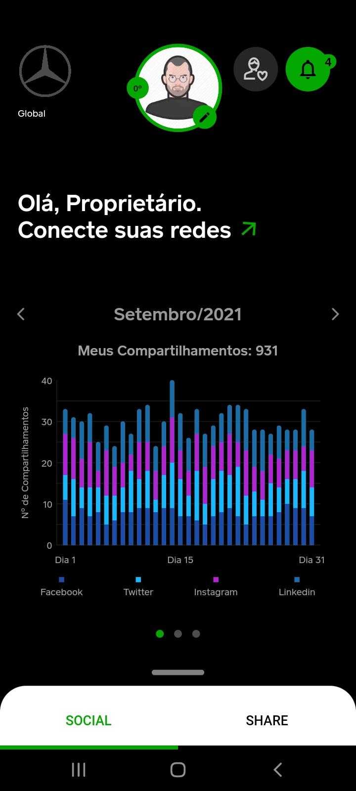
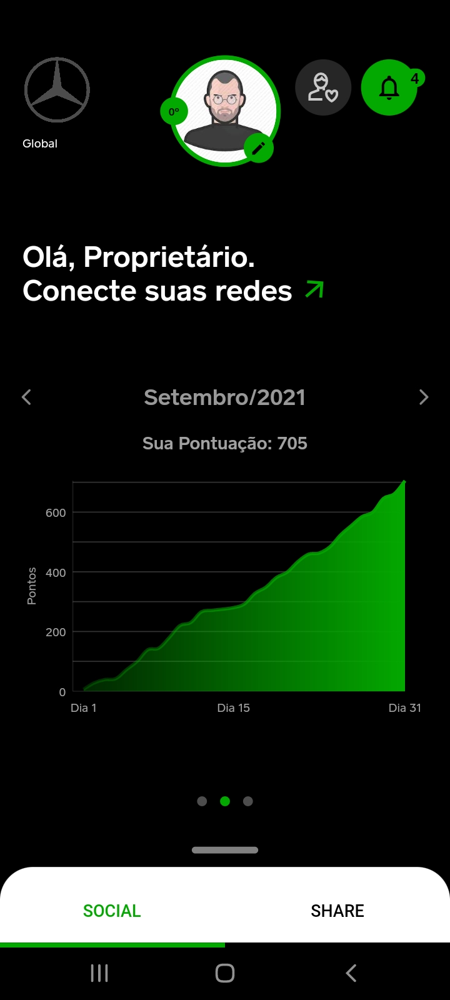
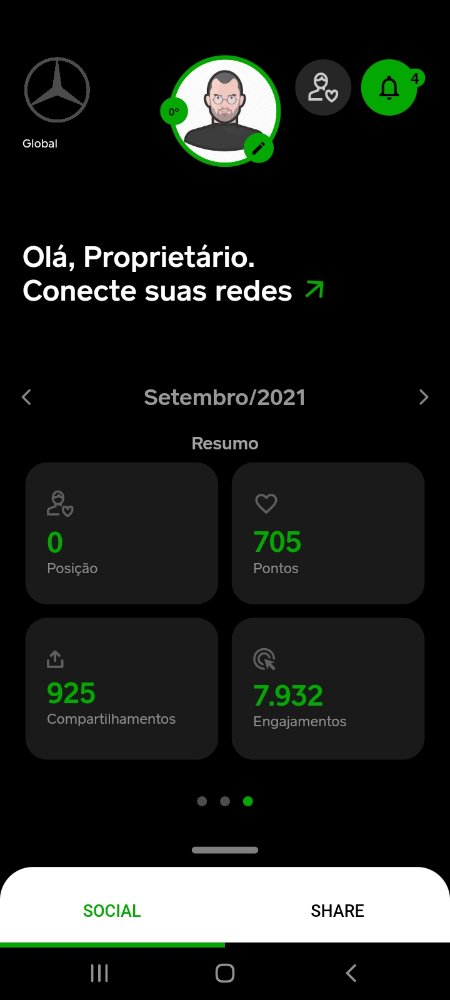
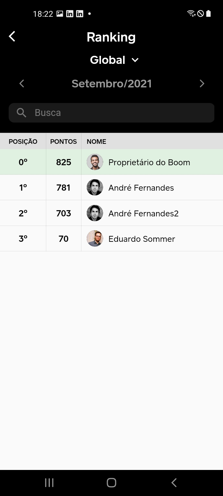
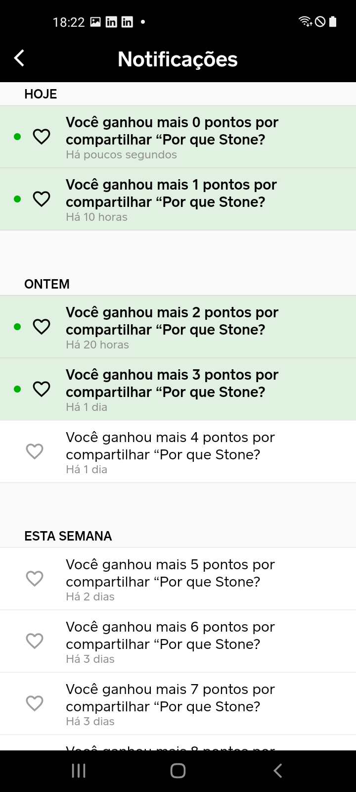
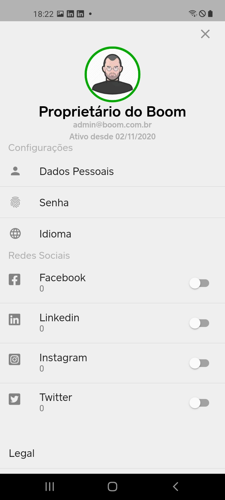

# 👋 Hi, I’m @rafaelqcosta. I'm a Flutter Developer 

The great pleasure introduce my self.

I’m Rafael Costa , Im from Brazil. Since 10 years I’m working as developer. Have developed many Web Systems and Mobile

With over five years of experience in mobile application development. I currently work with Flutter. Four years ago I started studying Flutter and I haven't stopped. It's the best tool I've ever worked with.

---

### Academic Background
*   **Post-Graduation in Mobile Development** - IGTI | 2022
*   **Technologist in Systems Analysis and Development** - UCB | 2015

---

## Certificates

- **MTA** - Microsoft Technology Associate (Certification nº: E078-4810)
- **MCP** - Microsoft Certified Profissional (Certification nº: D724-9116)
- **Scrum** Fundamentals Certified Credential (ID nº: 101167)
- Six Sigma **White Belt** - S.S.C. and Aveta Business Institute
- Six Sigma **Yellow Belt** (ID nº 72260) - Six Sigma Study
- CP-501 **XML** (ID nº 50776306) - National Computer Science Academy
- CP-240 **Visual C++ Programming** (ID nº 4872816) - National Computer Science Academy
- CP-420 **JavaScript** (ID nº 4872645) - National Computer Science Academy
- CP-440 **Java SE 6** (ID nº 4876236) - National Computer Science Academy
- CP-207 **SQL** (ID nº 5070834) - National Computer Science Academy

## Technical Skills

- **Languages:** Dart, Flutter,  Java, JavaScript, Angular, C#, Kotlin, Swift, SQL, NoSQL
- **Cloud Platforms:** Firebase, AWS
- **Methodologies:** Agile, Scrum, Kanban

---

### Professional Experience

#### DBC Company | Usaflex | Senior Flutter Developer
*Jan/2022 – Present*
I worked as the developer responsible for the Usaflex B2B application, participating in the product's creation, evolution, and continuous maintenance. I contributed from the architectural definitions (**Clean Architecture**, modularization) to the final delivery. I used **Flutter Modular** and **GetX** for route orchestration, state management, and dependency injection. I developed responsive interfaces and complex catalog and order flows. I performed integrations with REST APIs, Firebase, DevCycle, Amplitude, and internal services. I implemented tests, worked with **CI/CD** using **Codemagic** and **GitHub Actions**, and was responsible for the entire release flow, build engineering, and post-publication monitoring.

#### Magnum Bank | Sciensa | Senior Flutter Developer (part-time)
*Oct/2021 – Jan/2022*
Development of the digital bank application, using **BLoC**, **Flutter Modular**, and **Clean Architecture** principles. Contribution to interface construction, implementation of critical financial flows, secure API integrations, and state/navigation standardization. Worked in a highly regulated environment, ensuring security and reliability requirements were met.

#### Mangos | Senior Flutter Developer (part-time)
*Oct/2021 – Jan/2022*
Participation in the development of the Mangos cashback application, built in Flutter with a focus on scalability and high performance. Implementation of **GetX** for state management and **Clean Architecture**. Involved in creating registration, authentication, cashback flows, and integration with external services.

#### Brazilian Army | Senior Java Developer
*Mar/2017 – Jul/2018*
Development of internal systems using **Java, Spring Boot, and Angular**. Focused on backend architecture, REST integrations, service layer modeling, and frontend development, ensuring robustness and security.

#### Solo Produções | Mid-Level Java Developer
*Feb/2015 – Nov/2016*
Development of web applications using **JSP, HTML, CSS, JavaScript**, and backend integrations.

#### B2T | Mobile Developer Trainee
*Jan/2014 – Feb/2015*
Native mobile development for **Android, iOS, and Windows Phone**, creating flows, screens, functionalities, and integrations.

---

### Freelance Work (2018 to 2025)

#### Iterative | Pambank | Senior Flutter Developer
*Feb/2022 – June/2025*
Migration of a native production application (Kotlin and Swift) to Flutter, maintaining a hybrid architecture. Built the integration layer between native modules and Flutter using **MethodChannels/Platform Channels**. Structured the entire Flutter project, developed new features, and performed refactoring. Extracted and published a **Design System** package.

#### Iterative | O Novo Mercado | Senior Flutter Developer
*Feb/2022 – June/2025*
Worked on the mobile application (Android/iOS), from initial architecture to continuous delivery. Implemented a scalable architecture (**Clean Architecture, Flutter Modular, Triple**). Developed complex features (AI chat, optimized video streaming, real-time chat via **WebSockets**). Integrated with **Amplitude** and **DevCycle**. Implemented the **CI/CD pipeline with Codemagic** and adopted **Shorebird**.

#### Boom, Ipês, CháFraldas, and Binngo | Flutter Developer
*Jul/2018 – Oct/2021*
Developed various Flutter applications, responsible for the entire mobile process, from interface conception to API integrations, store publishing, and post-launch support.

### 📫 How to reach me: rafaqcosta@gmail.com and whatsapp +55 61 984261125

# Flutter App - Ipês

# Flutter App - Boom

    

# Flutter App - CháFraldas 

    
    
    

